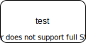

# Markdownのお勉強
## VS code での作成
- .mdファイルで新規作成  
- ハイフン"-"で箇条書きができる。
- 半角スペースを二回入れると改行になる。ただの改行ではつながる。
- 一行開けると段落が変わる。  
- [Ctrl] + [K] -> [V] でプレビュー表示になる。
- >引用も可能
- code記法  `import pandas as pd`
- **太字**, *イタリック*, ~~取り消し線~~
- ***
- [Markdown記法サンプル](https://qiita.com/tbpgr/items/989c6badefff69377da7)
- MarkdownのHTMLやPDFへのエクスポートには拡張機能が必要
- 数式  
拡張機能**Markdown Math**をインストール
$$
x = 2a
$$
- 画像

## Draw.ioの図を挿入
- 拡張機能 drawio integration ? をVS codeにインストール要
- `.drawio` または`.dio`の拡張子で作成すると自動的にdrawioが開く。
- `.drawio.svg` とすると、draw.ioで編集しつつ、保存したファイルはsvgファイルになる。
- More Shapeから **Proc. Eng.** を選択すると、プラント系の絵が使える（かなり種類が豊富で実用に足るレベル）
- svgファイルの挿入

## Gitでのバージョン管理

